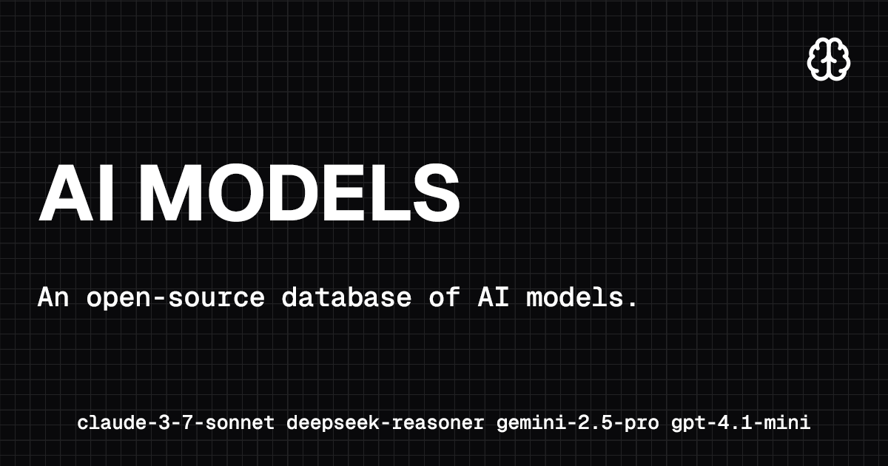

An open-source database of AI models with a modern web interface to explore and compare different AI models from various providers.

## Features

- **Comprehensive Model Database**: Curated collection of AI models from major providers
- **Rich Metadata**: Detailed information about capabilities, costs, limits, and modalities
- **Interactive Data Table**: Sortable and filterable interface to explore models
- **Modern UI**: Built with Next.js 15, Tailwind CSS, and Radix UI components
- **Type Safety**: Full TypeScript support with Zod schema validation
- **Dark Mode**: Elegant dark theme for better viewing experience

## Supported Providers

- **OpenAI** - GPT models and more
- **Anthropic** - Claude models
- **Google** - Gemini models
- **Mistral** - Mistral AI models
- **DeepSeek** - DeepSeek models
- **Vercel** - AI models
- **xAI** - Grok models

## Model Information

Each model includes comprehensive metadata:

- **Basic Info**: Name, provider, unique identifiers
- **Capabilities**: Tools, vision, reasoning, embedding support
- **Modalities**: Input/output support for text, audio, image, video, PDF
- **Pricing**: Input/output costs per million tokens, cache pricing
- **Limits**: Context window and output token limits
- **Features**: Temperature support, attachment handling, knowledge cutoff

## Getting Started

Models are served directly from a Cloudflare Worker. You can find the worker's source code [here](https://github.com/R4ULtv/ai-db/tree/main/.cloudflare/apis/src).

### Prerequisites

- Node.js 20+
- pnpm (recommended) or npm

### Installation

1. Clone the repository:
```bash
git clone https://github.com/R4ULtv/ai-db.git
cd ai-db
```

2. Install dependencies:
```bash
pnpm install
```

3. Run the development server:
```bash
pnpm dev
```

4. Open [http://localhost:3000](http://localhost:3000) in your browser. The models will be fetched from the Cloudflare Worker.

## Adding New Models

To add a new model to the database:

1. Create a JSON file in the appropriate provider directory under [`public/`](.cloudflare/apis/public).
2. Follow the schema structure defined in `lib/schema.ts`:

```json
{
  "id": "gemini-2.5-pro",
  "name": "Gemini 2.5 Pro",
  "provider": "Google",
  "provider_id": "google",
  "capabilities": [
    "tools",
    "reasoning",
    "vision"
  ],
  "attachment": true,
  "temperature": true,
  "knowledge": "2025-01",
  "modalities": {
    "input": [
      "text",
      "image",
      "audio",
      "video",
      "pdf"
    ],
    "output": [
      "text"
    ]
  },
  "cost": {
    "input": 1.25,
    "output": 10,
    "cache_read": 0.31
  },
  "limit": {
    "context": 1048576,
    "output": 65536
  }
}}
}
```

### Schema Fields

- `id`: Unique identifier for the model
- `name`: Display name of the model
- `provider`: Human-readable provider name
- `provider_id`: Provider identifier slug
- `capabilities`: Array of supported capabilities
- `attachment`: Whether the model supports file attachments
- `temperature`: Whether the model supports temperature parameter
- `knowledge`: Knowledge cutoff date (optional)
- `input_modalities`: Supported input types (optional)
- `output_modalities`: Supported output types (optional)
- `cost`: Pricing information (per million tokens)
- `limit`: Context and output token limits

## Contributing

Contributions are welcome! Please feel free to submit a Pull Request. For major changes, please open an issue first to discuss what you would like to change.

### Guidelines

1. Follow the existing code style and conventions
2. Add appropriate TypeScript types
3. Update documentation as needed
4. Test your changes thoroughly
5. Follow the model schema when adding new models

## License

This project is licensed under the MIT License - see the [LICENSE](LICENSE) file for details.

## Acknowledgments

- Built with [Next.js](https://nextjs.org/)
- UI components from [Radix UI](https://www.radix-ui.com/)
- Icons from [Lucide](https://lucide.dev/)
- Styling with [Tailwind CSS](https://tailwindcss.com/)

## Support

If you find this project helpful, please consider giving it a star ⭐ on GitHub!

For questions or support, please open an issue on the GitHub repository.
